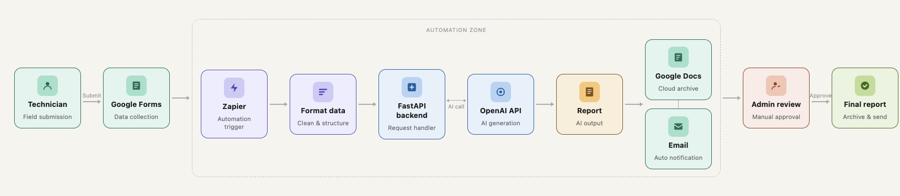
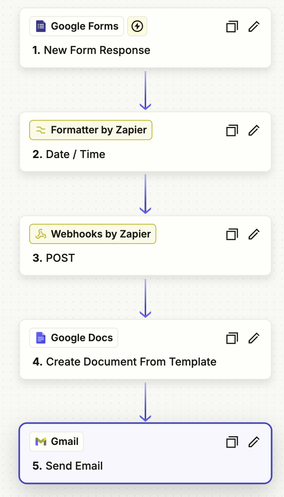

# AI-Powered Fire Compliance Report Generator Demo

Automated pipeline that transforms unstructured technician field notes into structured, AS1851-2012 compliant draft reports — triggered by Google Forms and orchestrated through Zapier.

## Background

Fire protection compliance in Australia is governed by **AS1851-2012** (*Routine Service of Fire Protection Systems and Equipment*). After each site visit, technicians must submit maintenance reports documenting inspected equipment, defects found, actions taken, and compliance status for every item.

Traditionally this requires manually converting raw field notes into formal compliance language — time-consuming, inconsistent, and error-prone. This system automates that step: a technician submits a Google Form, the workflow triggers automatically, and OpenAI GPT extracts a fully structured, AS1851-referenced draft report for qualified human review before it reaches the client.

## System Architecture

## Tech Stack

| Layer | Technology |
|---|---|
| Form & Data Capture | Google Forms |
| Response Storage | Google Sheets (auto-linked to Forms) |
| Workflow Automation | Zapier |
| Backend API | FastAPI (Python 3.12) |
| AI Engine | OpenAI API — `gpt-4.1-mini` |
| Document Generation | Google Docs (template-based) |
| Admin Notification | Gmail |
| Deployment | Render|

## AI Capabilities

The OpenAI integration performs the following on every submission:

| # | Capability |
|---|---|
| 1 | Extract device name, location, and condition from raw notes |
| 2 | Handle mixed-language or fragmented technician input |
| 3 | Split a single block of notes into individual per-equipment records |
| 4 | Map each item to the correct AS1851-2012 clause |
| 5 | Assign compliance status: `PASS` / `FAIL` / `ACTION REQUIRED` |
| 6 | Rewrite informal notes into formal AS1851-compliant English |
| 7 | Auto-generate a unique report number (`FR-YYYYMMDD-HHMMSS`) |
| 8 | Recommend next service interval per item (months) |
| 9 | Generate an overall compliance summary paragraph |

## What This Service Does

- Accepts technician service records from Zapier via a validated webhook.
- Validates a bearer token to prevent unauthorised access.
- Sends inspection notes and defect summary to OpenAI for structured extraction and formal language rewriting.
- Returns Zapier-friendly fields for Google Docs templating, compliance reporting, and admin review.

## Zapier Automation Flow

The entire pipeline runs automatically through a 5-step Zap — no manual action required after a technician submits the form.

| Step | App | Action | Purpose |
|---|---|---|---|
| 1 | Google Forms | New Form Response | Triggers on every new technician submission |
| 2 | Formatter by Zapier | Date / Time | Converts date to `YYYY-MM-DD` format for the API |
| 3 | Webhooks by Zapier | POST | Sends all form fields to the FastAPI backend and receives the structured AI-generated report |
| 4 | Google Docs | Create Document from Template | Populates a report template with the 24 structured fields returned by the API |
| 5 | Gmail | Send Email | Delivers the completed report and Google Docs link to the client |

## Try It Yourself

Want to see the full pipeline in action? Submit a test inspection using the live form below:

**[Fire Maintenance Site Notes Submission — Google Form](https://docs.google.com/forms/d/e/1FAIpQLSfuw8i0_qB4iqTDsf7-GUgR6FrC16EdCHVOGVBakRUtznmNaw/viewform)**

Use natural language to describe equipment status — for example:

**Raw Inspection Notes**
> "L2 server room CO2 extinguisher low pressure, removed from service. 
GF reception dry chemical ok. Basement FIP panel showing fault on 
zone 4, audible alarm functional. Sprinkler heads in warehouse 
checked, one head painted over near loading dock. Fire pump 
tested, started ok."

**Defects & Rectifications Summary**
> "Rooftop extinguisher missing safety pin — immediately unserviceable, 
removed from service, replacement ordered urgently. Hydrant outlet 
valve damaged, recommend immediate repair. Hose reel cabinet on L3 
locked during inspection, access must be provided at next visit. 
Exit sign bulb failure stairwell B, replace immediately."

The AI will automatically extract each equipment item, assign AS1851-2012 compliance status, and generate a structured draft report within minutes.

## Risk Controls

- The report title is always marked `[DRAFT]`.
- The AI prompt explicitly forbids invented data — missing details are flagged in `missing_information`.
- The service does not make legal compliance decisions. `PASS`/`FAIL`/`ACTION REQUIRED` are draft assessments only.
- Final issuance requires review and sign-off by a qualified fire protection technician.
- Client issue must happen only after a separate internal review and approval step.
